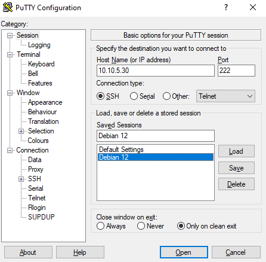

# Sprint 04 - Documentation d'Installation - Projet 3 - Groupe Sans Souchis


## Prérequis techniques

## Etapes d'installation et de configuration (instructions étape par étape)

### Installer et configurer les services SSH sous Windows

#### Installation OpenSSh

Connecté à internet, installer SSH serveur en entrant la commande dans une console powershell :

```powershell
Get-WindowsCapability -Online | Where-Object Name -like ‘OpenSSH.Server*’ | Add-WindowsCapability –Online
```

Installer SSH client
```powershell
Get-WindowsCapability -Online | Where-Object Name -like ‘OpenSSH.Client*’ | Add-WindowsCapability –Online
```
#### Gestion et configuration

S'assurer qu'OpenSSH serveur est bien installé sur le système
```powershell
Get-WindowsCapability -Online | Name -like 'OpenSSH.Ser*'
```
S'assurer qu'OpenSSH client est bien installé sur le système
```powershell
Get-WindowsCapability -Online | Name -like 'OpenSSH.Cli*'
```

Créer une règle dans le parefeu en ouvrant le port 22 pour SSH si elle n'existe pas :
```powershell
if (!(Get-NetFirewallRule -Name "OpenSSH-Server-In-TCP" -ErrorAction SilentlyContinue | Select-Object Name, Enabled)) {
    Write-Output "Firewall Rule 'OpenSSH-Server-In-TCP' does not exist, creating it..."
    New-NetFirewallRule -Name 'OpenSSH-Server-In-TCP' -DisplayName 'OpenSSH Server (sshd)' -Enabled True -Direction Inbound -Protocol TCP -Action Allow -LocalPort 22
} else {
    Write-Output "Firewall rule 'OpenSSH-Server-In-TCP' has been created and exists."
}
```

```powershell
if (!(Get-NetFirewallRule -Name "OpenSSH-Server-Out-TCP" -ErrorAction SilentlyContinue | Select-Object Name, Enabled)) {
    Write-Output "Firewall Rule 'OpenSSH-Server-Out-TCP' does not exist, creating it..."
    New-NetFirewallRule -Name 'OpenSSH-Server-Out-TCP' -DisplayName 'OpenSSH Server (sshd)' -Enabled True -Direction Outbound -Protocol TCP -Action Allow -LocalPort 22
} else {
    Write-Output "Firewall rule 'OpenSSH-Server-Out-TCP' has been created and exists."
}
```
```powershell 
New-NetFirewallRule -Name sshd -DisplayName 'OpenSSH Server (sshd) - Port 222' -Enabled True -Direction Inbound -Protocol TCP -Action Allow -LocalPort 222
```

Démarrer le service SSH :
```powershell
Start-Service sshd
```

Activer le démarrage automatique d'OpenSSH au démarrage du système 
```powershell
Set-Service -Name sshd -StartupType 'Automatic'
```

Configurer le fichier serveur OpenSSH
```powershell
start-process notepad C:\Programdata\ssh\sshd_config
```

Redémarrer le service SSHD afin d'appliquer la configuration
```powershell
restart-service sshd
```

Se connecter au serveur en ssh :
```cmd
ssh <utilisateur.domaine> -p <port>
```

Générer une nouvelle clé ssh avec la commande `ssh-keygen` 

Pour ajouter à ssh-agent une clé ssh :
```cmd
# Activer le service ssh-agent au démarrage de l'OS
Get-Service ssh-agent | Set-Service -StartupType Automatic

# Démarre le service
Start-Service ssh-agent

# Vérifier que le service est bien en cours d'execution
Get-Service ssh-agent

# Ajoute la clé SSH à ssh-agent
ssh-add $env:USERPROFILE\.ssh\<fichierid_ecdsa
```

## Connection en SSH avec Putty

Télécharger et installer le logiciel Putty pour se connecter en SSH

Entrer l'adresse IP du serveur SSH auquel on veut se connecter et configurer le port sur lequel le server est en écoute.
Il est possible d'enregistrer les paramétres de la sessions pour une connexion ultérieur.\


Pour gérer les clés SSH avec Putty, utiliser le programme puttygen.exe
Pour importer des clé ssh dans puttygen, séléctionner le type de clé ssh (RSA,ECDSA...) et cliquer sur __load__, puis importer la clé privée. Si la clée n'est pas au format spécifique de putty, séléctionner __all files__ dans le menu déroulant des extentions de fichier et importer la clé privée.


### Installer et configurer les services SSH sous Linux

#### Installation OpenSSH

Télécharger et installer les paquets __OpenSSH server, OpenSSH client et sftp__ avec la commande :

```bash
sudo apt install openssh-server openssh-client sftp
```

#### Configuration d'Open SSH serveur et client
Modifier le fichier de configurations SSH serveur avec la commande :

```bash
vi /etc/ssh/sshd_config
```
modifier le fichier de configurations SSH client avec la commande :

```bash
vi /etc/ssh/ssh_config
```

Il est possible de créer un fichier de configuration personnaliser, serveur ou client, sous la forme __<nom-fichier>.conf__ dans le dossier à l'emplacement `/etc/ssh/sshd_config.d/` pour le serveur ou `/etc/ssh/ssh_config.d/` pour les clients. 

Le fonctionnement de la configuration du serveur peut être vérifier grâce à la commande :
```bash
sshd -t /etc/ssh/sshd_config.d/<nom-fichier>.conf
```

Appliquer la configuration du fichier __<nom-fichier>.conf__ au serveur grâce à l'option __-f__

```bash
sshd -t -f /etc/ssh/sshd_config.d/<nom-fichier>.conf
```

Si on souhaite se connecter en root sur le serveur SSH debian, dans le fichier `/etc/ssh/sshd_config` décommenter et éditer la ligne __PermitRootLogin__ de cette façon `PermitRootLogin yes`

Pour préciser la liste d'utilisateurs autorisés ou interdit à se connecter, ajouter les lignes :

```powershell
AllowUsers <utilisateur1> <utilisateur2>

ou

DenyUsers <utilisateur1> <utilisateur2>
```

#### Gestion SSH

Vérifier le status du processus SSH serveur avec la commande :
```bash
systemctl status sshd
```

et le client avec
```bash
systemctl status ssh
```

copier une clé ssh publique sur le serveur avec sftp

```bash
sftp get <source/chemin/mon/fichier_rsa> /etc/ssh
```

ajouter une clé ssh à un ordinateur distant avec sftp
```bash
sftp put <source/chemin/mon/fichier> <destination/fichier>
```

Copier le contenu de la clé SSH publique du client avec lequel se connecter dans `~/.ssh/authorized_key`

##### Autoriser uniquement un groupe d'utilisateur à se connecter en SSH

Installer le paquet sudo pour autoriser les utilisateurs membres du groupe sudo à utiliser des commandes administrateur

```bash
apt update

apt install sudo
```

Créer un groupe d'administrateur 
```bash
sudo groupadd groupname
```

Lister les groupes de l'ordinateur
```bash
cat /etc/group
```


Créer un nouvel utilisateur avec le shell bash par default, un folder /home, l'ajouter à un groupe principal et secondaire
```bash
sudo useradd -g <groupe_principal> -G <groupe_secondaire1,groupe_secondaire2> -m -s /bin/bash <nom_utilisateur>
```

Assigner un mot de passe au nouvel utilisateur
```bash
passwd <nom_utilisateur>
```

Afficher les groupes dont l'utilisateur est membre
```bash
groups <nom_utilisateur>
```

Retirer un utilisateur d'un groupe
```bash
sudo gpasswd -d <nom_utilisateur> <nom_groupe>
```

ajouter le groupe admin au fichier sudo avec __visudo__ 
```bash
visudo /etc/sudoers

#Au dessous de la ligne qui commence par %sudo, ajouter la ligne suivante :
%<nom_groupe> ALL=(ALL) ALL
```
Enregistrer avec __ctrl+x__ puis __Y__ et __ENTRER__ pour fermer visudo (similaire à Nano)


Autoriser uniquement le groupe admin à se connecter en ssh
```bash
sudo vim /etc/ssh/sshd_config

#Ajouter la ligne la ligne suivante pour autoriser uniquement les membres d'un groupe à se connecter en ssh 
AllowGroups <nom_du_group1>,<nom_du_group2> 
```


## FAQ : solutions aux problèmes connus et communs liés à l'installation et à la configuration
